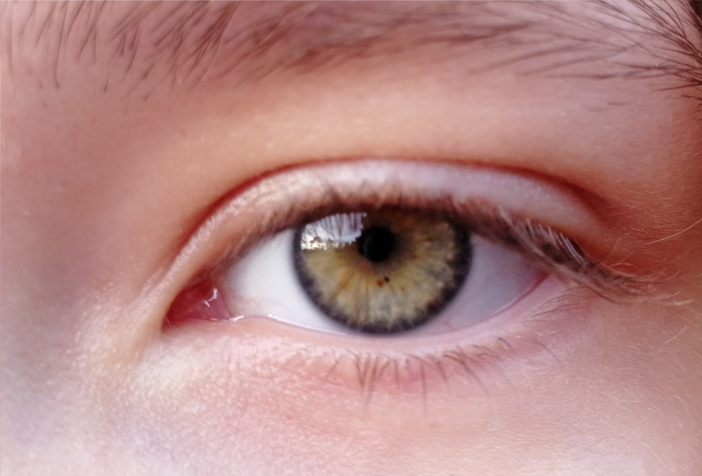
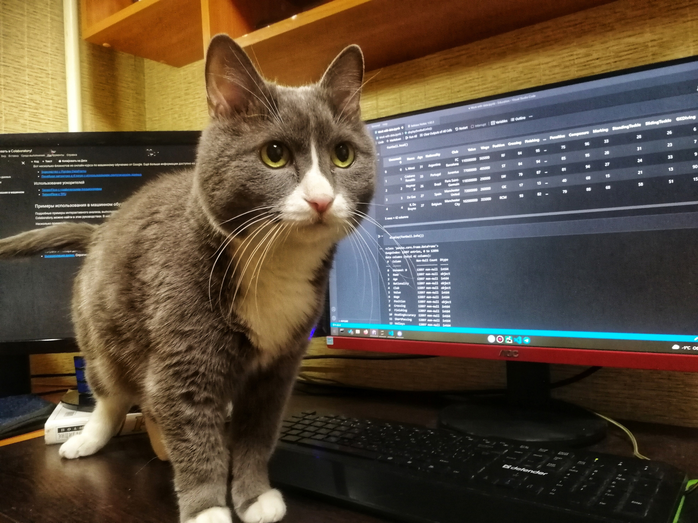
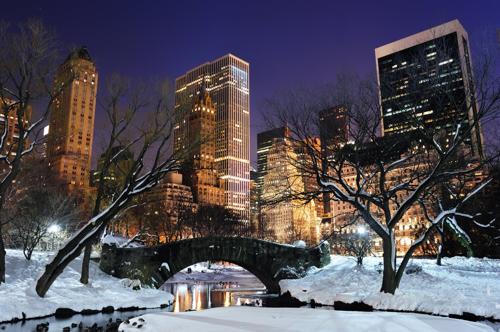
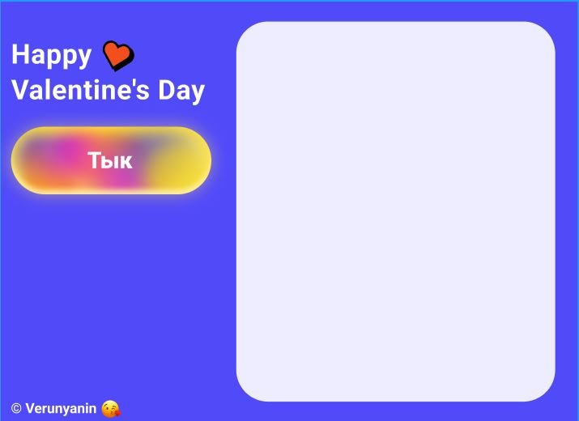

# Saint-Valentine
### Умничка, если отгадала шифр. И эти слова я посвещаю тебе 💝
----

### Вер, хочу сказать прямо и честно: мои слова, что я бы бросил себя сам - были скорее, как утешение, я потерялся, смотря на твои слезы. Мне пришлось сильно повзрослеть и многое осмыслить, и это не конец, мы всегда растем и развиваемся. Надоело уже ходить вокруг, да около и я считаю нужным рассказать тебе, что случилось со мной летом и особенно во время твоей поездки на юг:

### С каждым днём военкомата и споров внутри семьи это отражалось на мне и я реально испугался будущего, начал сомневаться, все ли я делаю правильно, я злился, что многое не всегда полностью зависит от нас и произошла череда событий: рецидив у мамы, финансовые споры в семье, твой отъезд в Сочи, падения моих инвестиций (SPCE) и самое наверное трудное - я закрылся. Испугался, что смогу потерять однажды всё и даже не буду способен на это повлиять и начал злиться на всех вокруг, после этого ударил военкомат и моя простуда. Я уже просто не понимал, что мне делать и я буквально ранил всех, ну и впервую очередь попала под это ты, я разругался со многими друзьями, у меня появлялась апатия ко всему, я не мог уснуть из-за сомнений, но случился один переломный момент, это тот разговор после парка, меня буквально он перезагрузил, я долго думал и понял, что он мне дал: я почувствовал, что я хочу поменять. Тяжелый момент породил сильную личность: я четко последовал, тому, о чём я мечтал в самом сердце, сейчас расскажу и тебе.

---
## **Семья**
### Я никогда не знал, что такое любовь, постоянно сомневался, но я почувствовал это только с тобой, я долго отвергал чувства, потому что оно было незнакомо и ново для меня. И самый классный период был, когда мы чуть-чуть жили вместе (Мне пришлось уходить часто домой, потому что были семейные проблемы, прости, что не говорил) я на несколько дней исполнил свою мечту, прикоснулся к ней, к нормальным, взаимоуважаемым отношениям между двумя любящими друг друга людьми. И для меня любовь - это не собственное ощущение влюбленности, а в противовес эгоизма - получение положительных эмоций, когда ты делаешь партнера счастливым, желания жизни, физического и духовного развития ему. И теперь ты понимаешь, почему в тот момент плохо стало нам обоим.

----
## **Карьера**
### С карьерой я был очень близок, я создал с ребятами проект, внедрил свои нейронные сети, которые вытекли из моего программирования, а ведь я о нём узнал только в 9 классе и меня это так сильно погрузило, буквально изменив мою жизнь и я очень рад, когда ты тоже интересуешься этой сферой, а я знаю, тебе это также нравится. В итоге мы почти выиграли конкурс, но не подошли под тематику номинаций и спасибо тебе за поддержку, я уверен, всё впереди. И твои цели и мои исполнимы, и несмотря ни на что, я всегда тебя поддерживаю! Мне очень важно, чтобы мы разделяли наши интересы. Добавлю о моем сомнение с ВУЗом, я хотел переехать вместе с тобой в новый город, мне было важно, чтобы ты не уменьшала амбиций, ведь ты действительно способная и упорная в своих целях. Получилось, как получилось, я считаю в итоге мы сделали рациональный и верный выбор, в котором наши отношения сыграли важную роль. (Ты выбрала ту специальность, которую хотела, я - форму обучения.) И мне очень важно, чтобы мы никогда не сомневалась в своих целях, мы умеем их отлично отстаивать.

---
## **Путешествия**
### Путешествия это отдельная строка, я обожаю их, но здесь я наверно почти не достиг успехов, все мои поездки, это сатира над нормальным уикендом. Я очень много читаю о странах, да я Лос-Анджелес знаю лучше, чем Екатеринбург, о чем речь. И в тебе я увидел такого же человечка, который буквально горит этим. И я приложу все усилия, чтобы добиться этого, но путешествовать одному не всегда интересны. Я мечтаю прогуляться по рождественскому Централ-парку, держа за тебя руку и неожиданно целовать в момент, когда ты любуешься этим новогодним волшебным чудом.

---

### Я стал сильнее, вцепился в эту жизнь, я пылаю каждым моментом, я четко знаю что хочу и буду делать. Да, вот так бывает, ты не всегда способен сказать, что хочешь, иногда решаешь лучше промолчать, но в этом и прелесть жизни, мы падаем, встаем, еще раз 100 раз падаем и уже думая, что всё, это конец, находим силы, поднимаемся и получаем то, что хотели. Я думал любовь только причиняет боль, но оно оказывается все наоборот, главное никогда не сдаваться.

### Верунь, я хочу радовать тебя всегда, помогать, когда ты попросишь, утешать, когда ты заплачешь, гордиться, когда победишь, поддержать, когда ты в сомнениях. Мы для друг друга очень важны, я осознал самое важное и ты, я уверен, тоже: нужно постоянно развиваться. С тобой я готов буквально крушить мир, я не знаю как, так получилось, но мы нашли друг друга рано, давай используем это максимально, как хотим мы. И будем всегда говорить, то, что хотим друг от друга. Вер, ты согласна, взяться за руку? 💕 

___

### Также я создал для тебя программку iloveyou.py - это электронная валентинка, снизу так выглядет её фронтенд

### **P.S. Дневник создания:**

#### **Мои слова во одном из снов, тогда я впервые победил себя:**
Так никто не делает, но доверься мне, вернемся, как будто в машине времени, в ту секунду. Давай расстанемся, услышал я твои слова. Но ведь это сделать успеют всё, а справится не каждый. Сожму твои руку и прижму тебя к сердцу, обнимая, скажу: "Если мы продержимся сейчас, то станем самими счастливыми, расскажи мне, что бы ты хотела поправить?". Я никогда не отпущу человека, который однажды подарил и развил во мне неугасаемый огонь. А если с ним что-то случится я готов сделать тоже самое. И ведь я не сдался, несмотря на всё я начал слушаться сердце - я научился эмпатии, звучит странно, но мне пришлось лишиться этого, теперь я его не отдам никогда. Я разделю свои чувства с тобой, Вер и всегда разделял, ты ведь знаешь какую я работу совершил над собой и какую совершила ты. Я не выбрал удобный путь, а выбрал тот, о котором никогда не пожалею - тебя Вера.

Надеюсь, что я успею, потому что у меня сильно поднялась температура 😷, и я хочу сделать этот день святого валентина - лучшим, который у тебя был.

В этот проект я вложил всего себя, я писал эти строки, когда моё сердце по-настоящему горело тобою.
